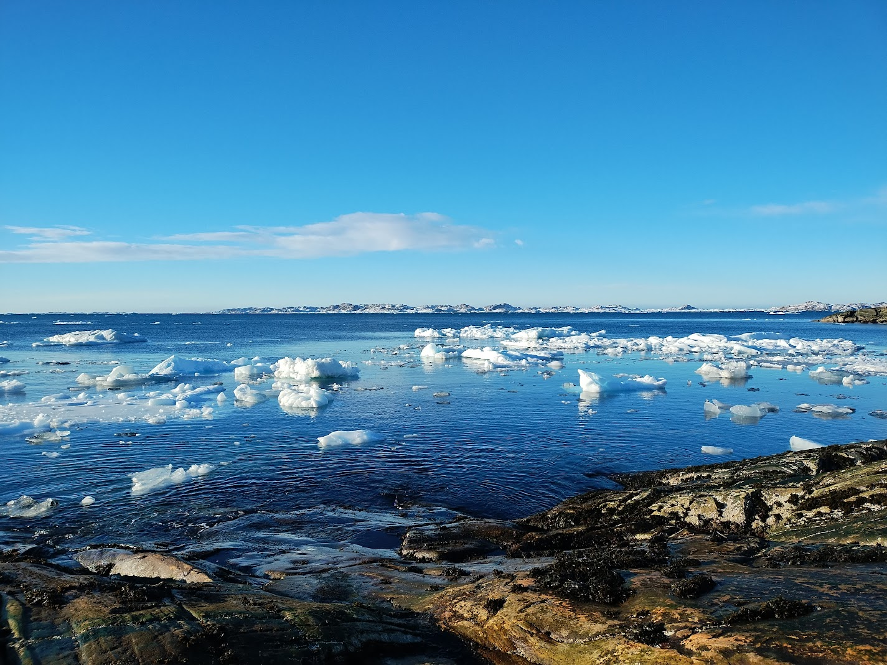
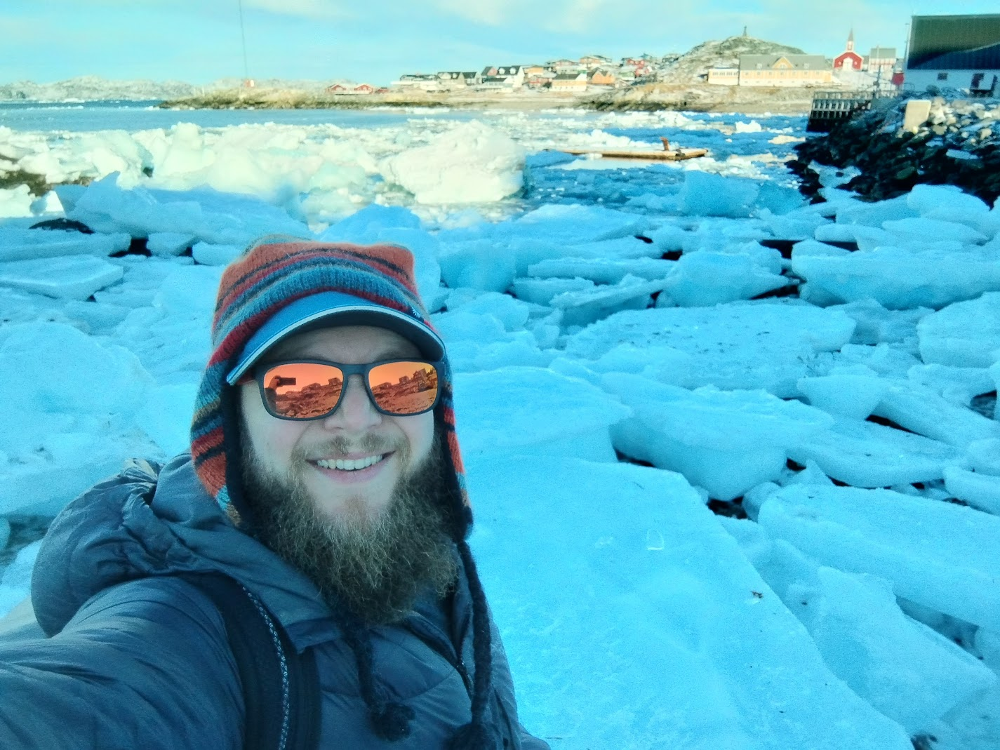
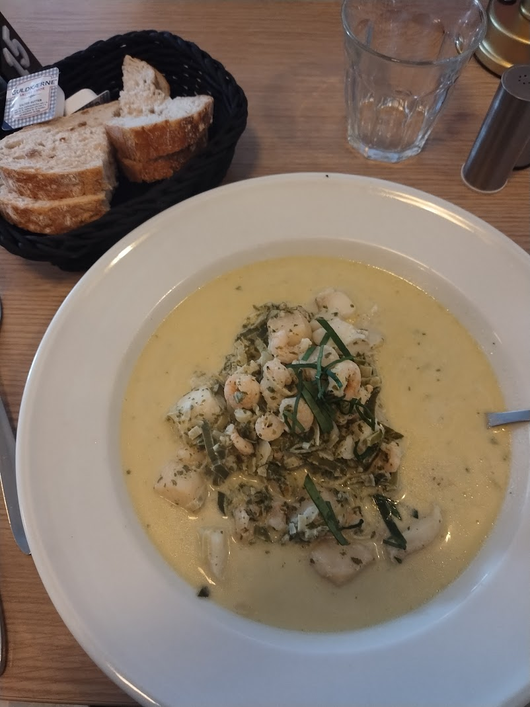
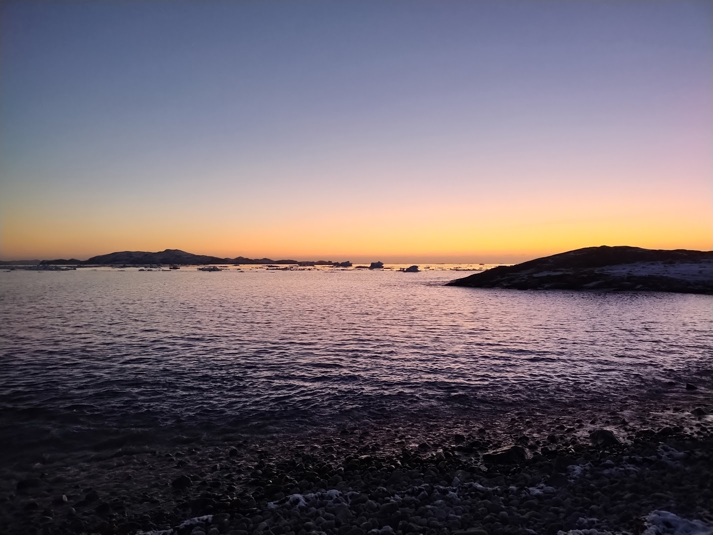
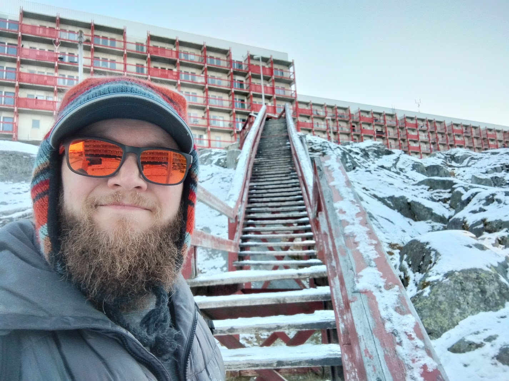

Today (Nov. 2nd) I successfully landed in Nuuk!

{width=100%}

I am so very happy to have landed and checked into my hotel for the night. It is
a huge relief after a long "day" of travel that started on the afternoon of
Nov. 1.

## Road bumps

As is usual on the day leading up to depature, I had a lot of anxiety. Despite
my best efforts to plan and carefully pack, I had a nagging feeling that I was
forgetting something (I don't think I did).

To make matters worse, I also has some reservations about checking luggage. The
last time I flew with Icelandair in September, my baggage was delayed on the way
home, and I resolved to "one-bag" my next trip to avoid the headache. Of course,
when it came time to prepare for this trip, I changed my mind and decided to
check a bag. After all, I could only fit one change of clothes in my carry-on
along with my laptop and other essentials.

Unfortunatley, bad luck struck right out of the gate - the first leg of my trip
from Denver to Keflavík was delayed by a couple of hours due to a mechanical
issue. This meant I had very little time between landing in Iceland and taking
off for Nuuk - I had to run! Unfortunately, my checked luggage was not as fast
as I was, and did not make the flight. This means I am without much of what I
packed for at least the next few days (my bag is estimated to arrive in Nuuk on
the 5th, while I am in Ilulissat).

On the bright side, I am in Greenland and the rest of my travels went relatively
smooth. Many of the other passengers on the flight that was delayed had much
tighter turn-around times and ended up having to rebook the second leg of their
trip for a different day.

## A day in Nuuk

After checking into the hotel, my first priority was to get some food - I had
not had anything significant to eat since lunch the previous day!

I beelined for a bakery in a nearby supermarket that I remembered from my trip
in 2023. I recalled it having savory baked goods during some times of the day,
and I was hoping to get a sausage roll. They did not have any savory goods
available when I went in, but they had another item that was high on my list: a
Københavner.

.](../images/kobenhavner.jpg){width=100%}

Although not the meal I was looking for, I devoured the Københavner and rightly
guessed it would tide me over until I could find something more
significant. This was important, because I quickly became distracted by the
sight and sounds of floating ice:

{width=100%}

{width=100%}

I spent a good amount of time hiking along the coast, watching the ice flow and
sway with the waves. Occasionally, the sound of two large chunks crashing
together would punctuate the sound of waves against the shore. On a few
occassions I saw a larger berg break apart into smaller bits. I have never seen
icebergs and sea ice so close before - it was mesmerizing!

{width=100%}

{width=100%}

Finally, I tore myself away from watching the ice and had a real meal: creamy
seafood soup with shrimp, scallops, and fish (the menu said salmon, but I think
it was cod or char - not sure, but it was good!)

{width=95%}

## Early evening

The daylight is gone now and I am exhausted. It's around 7:30PM now, and
although this is a pretty early time for me to call it a night, I think I need
to! The little sleep I got during my flights was not very restful, and I have
another busy travel day tomorrow!

{width=100%}

Plus, I gotta say - hiking around Nuuk can be a workout! There are a lot of
rocky hills to navigate. Stairs make it easier to get around, but they are also
exhausting.

{width=100%}
