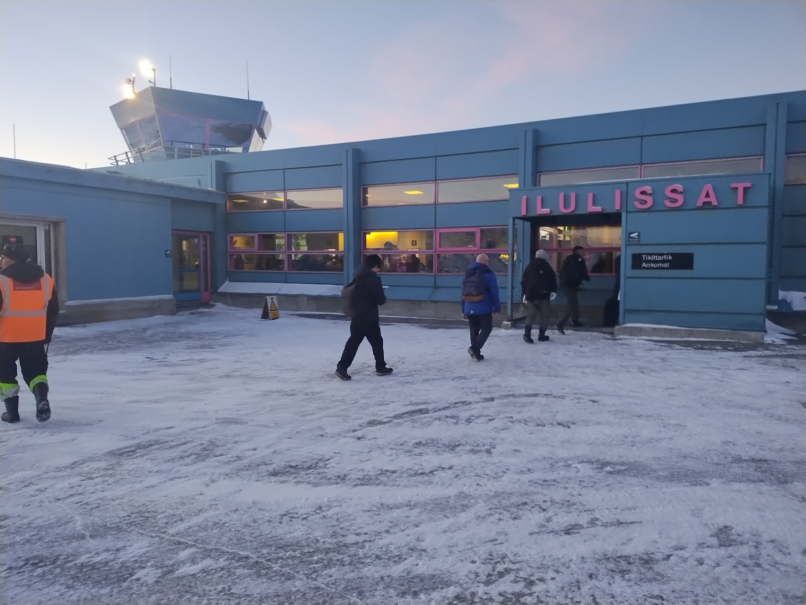

As expected, today started early. With the airport shuttle expected at 6AM, I
awoke just before 5 to ready myself for the day to come. After packing my things
and having a quick bite of the hotel's breakfast, I went out into the dark and
chilly morning to await the bus where it dropped us off the day before.

Given the other delays I've encountered, it was no suprise that the bus was a
little late picking us up (15 minutes - but it felt much longer!). Thankfully,
the rest of the morning went as planned and I boarded the flight for Ilulissat
on-time.

 to
Ilulissat](../images/boarding_for_ilu.jpg){width=100%}

{width=100%}

One silver lining of my flight being pushed back a day was that my rebooked
flight was direct to Ilulissat. If things had gone accordding to plan yesterday,
I would have had short stops in Maniitsoq and Sisimiut. This saved me about an
hour on the plane!

{width=100%}

{width=100%}

From the airport, I took a short taxi to the hotel where I checked in and found
that my luck had improved to the point of getting a corner room with a
spectacular view of the bay.

{width=100%}

After settling in, I set out on foot for an exploration of town. Everywhere I
looked I was met with stunning views.

{width=100%}

One of my favorite locations was the harbor. Coming from a land-locked state, I
find looking at all of the various boats and coastal infrastructure to be
immensely interesting.

{width=100%}

{width=100%}

To cap off the day, I went on a guided excursion to view the aurora borealis
(AKA northern lights) just outside of town. The moon was full and bright, so
conditions were not ideal, but I did end up seeing them and a shooting star!

![~~The orbs/aura of light at the center of this image was how the northern
lights started. It was a ghostly apparition that drifted across the sky for a
while before eventually transforming into the more traditional line of lights
that are so common in photos. Our guide said he had never seen the lights appear
quite this way. Unfortunately I don't have any other pictures.~~ Update
2025-11-06: it turns out that this was exhaust from the [Ariane 6 rocket that
deployed the new Sentinel-1D earth-observing
satellite](https://www.esa.int/Applications/Observing_the_Earth/Copernicus/Sentinel-1/Sentinel-1D_reaches_orbit_on_Ariane_6)!
I originally thought this was the beginning of the northern lights (we saw them
around the time this dissipated), but it was just coincidence! It was also
[observed over
Maine](https://www.newscentermaine.com/article/tech/science/aerospace/ariane-6-europe-rocket-spiral-exhaust-plume-high-altitude/97-d6db4674-9ca2-4dd1-b371-c55c1c78e6c6).](../images/northern_light.jpg){width=100%}

Now it's a bit after 11PM and exhaustion is starting to set in. It has been a
LONG day. I look forward to tomorrow, but I think I'll sleep in a bit.
