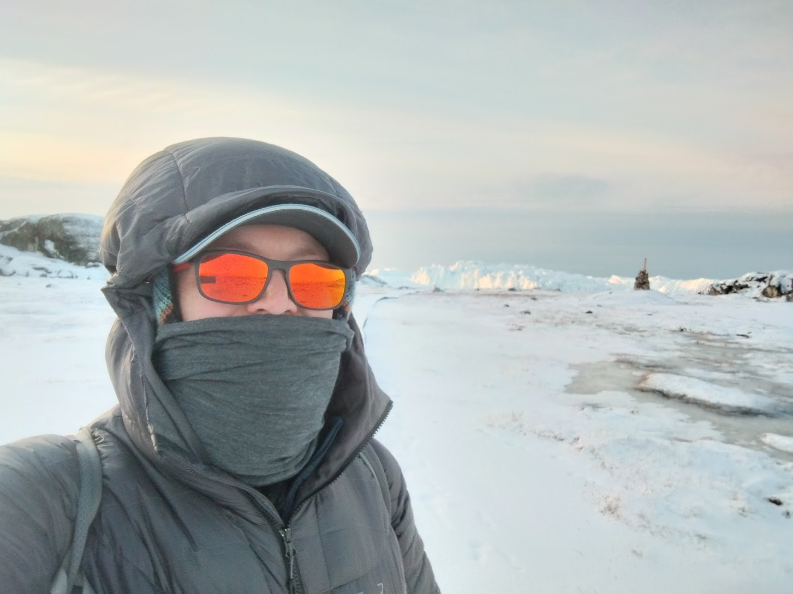
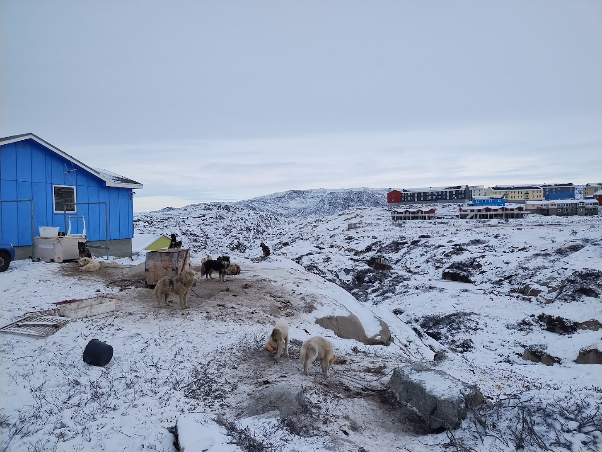
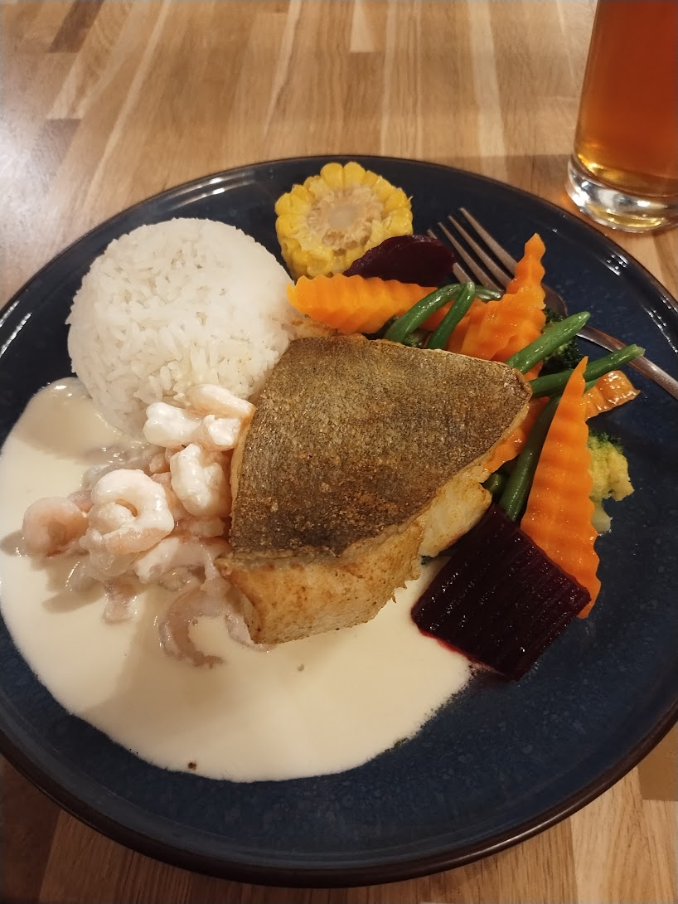

My first full day in Ilulissat started by waking up right around 8AM. Had the
need to arise for the bathroom not struck, I'm sure I would have slept in for at
least another hour - maybe more! I was suprised by the time, and figured it was
still middle of the night!

I considered going back to bed, but I knew that breakfast hours at the hotel
were limited, and I wanted to make the most of my first full day. 8AM is still
"sleeping in" compared to my 5AM wakeup yesterday.

I began my day with a hike to the Icefiord. It was time to see the "big ice".

{width=100%}

When I told one of my taxi drivers in Nuuk that I was going to Ilulissat, he
remarked that I was going to see the "big ice". I don't think I really
understood what he meant at the time. After all, I saw some pretty big ice
chunks off the coast of Nuuk. How much bigger could the icebergs in Ilulissat
really be? I have seen plenty of pictures of massive icebergs before, and I had
heard how big they could get, but that did not prepare me for
witnessing it in person. My pictures do not do it justice.

{width=100%}

{width=100%}

{width=100%}

I spent a fair bit of time marveling at the behemoths of ice before heading back
to the hotel. On the way, I grabbed a sandwich and another Københavner from a
bakery for lunch.

. This simple
sandwich was super satisfying after hiking to the icefiord and back.](../images/seed_roll_sandy.jpg){width=100%}

With lunch out of the way, I was ready for my next adventure: dog sledding!

There are a LOT of sled dogs in Ilulissat - estimates are around 3 thousand live
in town. And they're LOUD! Walking around, it is common to see and
hear sled dogs howling and barking.

{width=100%}

Generally, one should avoid interacting with the dogs. They are working animals
and they are bred and trained specifically for the task of pulling sleds (this
is an important form of transportation during the winter months when it is no
longer possible to navigate boats through the sea ice^[when I was at the
Mapping the Arctic conference in Nuuk in 2023, the commander of the Joint Arctic
Command gave a talk in which he mentioned sled dogs being a matter of national
security because sledding is one of the most effective ways of patrolling the
Greenlandic coast during winter.]). They can be very territorial and potentially
dangerous to anyone but their owner, so I try to keep my distance.

Although the season is still very early, I was lucky enough to find a
guide^[<https://www.dogsled-ice-academy.com/>], Jørgen, who let me meet his ~40
dogs and go for a ride!

{width=100%}

{width=100%}

{width=100%}

It was VERY bumpy. The snow was thin and only just enough to allow the ride, but
I still had a wonderful time. Jørgen told me that he used to be able to
reliably sled as early as October, but no longer. The [rapidly changing climate
in the Arctic](https://en.wikipedia.org/wiki/Climate_change_in_the_Arctic) has
profound implications for those who live here. I could say more, but will leave
that for some future posts. I expect to hear a lot on the topic next week when I
attend Greenland Science Week in Nuuk.

To cap off my dog sledding experience, Jørgen let me tag along as he fed his
dogs. We walked around with a big tub of fresh halibut filets that Jørgen tossed
to the dogs. This evoked a flurry of activitiy from the dogs as the excitment of
mealtime set in. As soon as we finished the rounds and the remaining filets were
put away, silence filled the air. Fed dogs are happy, quiet dogs!

Halibut fishing is common in
Ilulissat^[<https://isfjordscentret.gl/en/greenland-halibut-fishing-intermediate-level/>],
and seeing the dogs get this treat made me jealous. So for dinner, I got some
for myself!

{width=100%}

Now I'm winding down for the night and getting ready for bed. I look forward to
another exciting day of adventures tomorrow!
