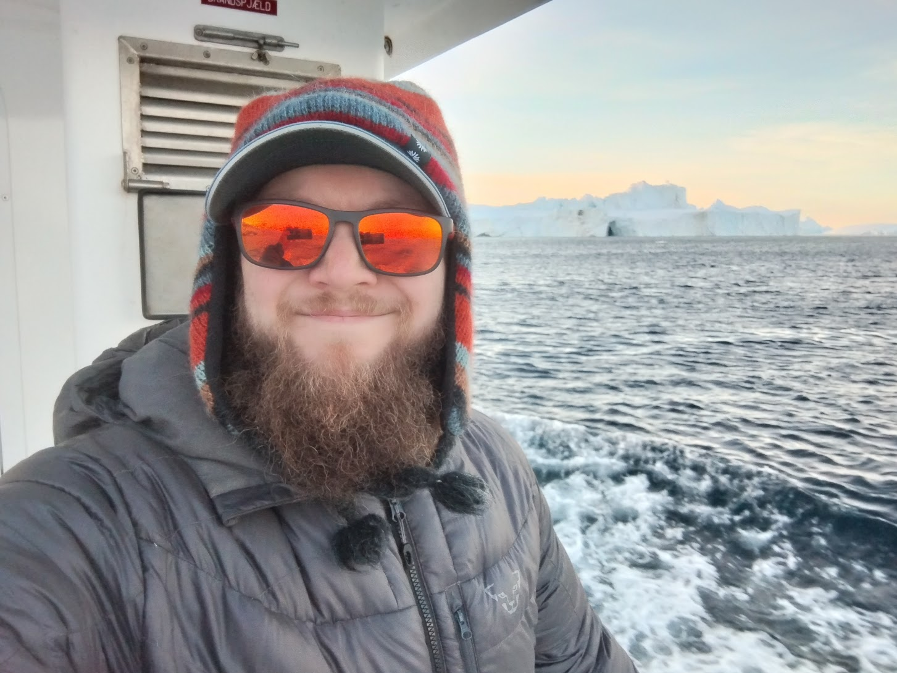
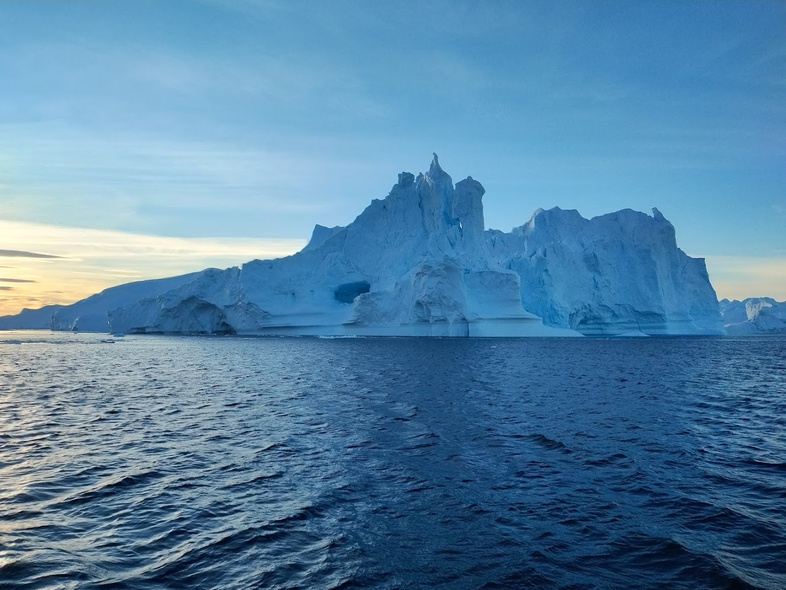
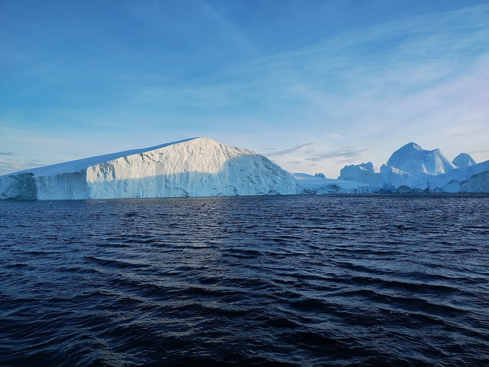
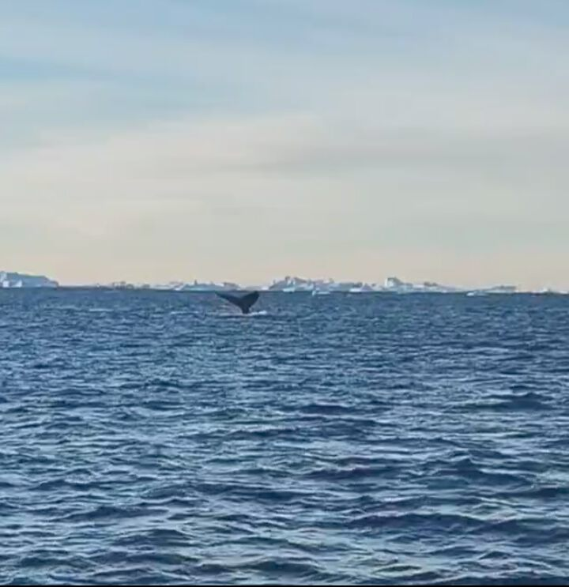
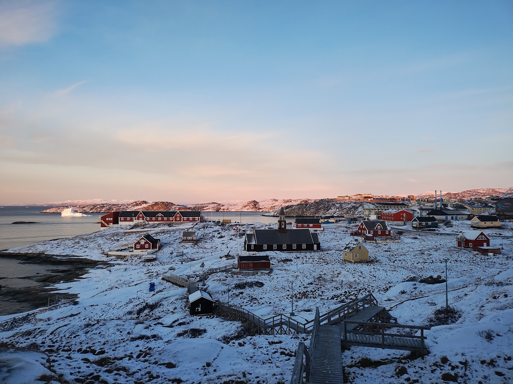

Today once again began right around 8AM. For whatever reason, I didn't sleep as
well as I had hoped last night. I kept waking up and feeling like I couldn't get
back to sleep easily. This caused me to feel pretty out of sorts this morning,
but my excitment for the day eventually won me over, and I managed to
get myself up and ready.

Today I had a single activity planned: a boat tour that would take me to the
mouth of the icefiord!  At around 10:30AM, I went to the harbor and boarded a
boat with a few other people and set off for an adventure on the water. Coming
from a land-locked state, the opportunity to do this excited me greatly. I
remember absolutely loving the boat tour I took around Nuuk in 2023, and I had
no doubt this would eclipse that experience by a longshot. I was not wrong.

{width=100%}

Almost as soon as we left the vicinity of Ilulissat we began to encounter the
massive icebergs that I first got a good look at yesterday during my hike.

Once again, I cannot stress how big these icebergs are. The pictures really do
not do justice to their size and magnificence. Our guide told us that the
largest recorded iceberg claved from the glacier was the size of Manhattan in
NYC. We didn't see any THAT big, but that helps puts things into perspective a
bit better than the pictures can alone. Another fact that I read is that the
total amount of ice calved from the glacier each year is enough to cover the
USA's entire annual water consumption. It's a HUGE amount of ice.

{width=100%}

{width=100%}

{width=100%}

{width=100%}

{width=100%}

My pictures also fail to capture all of the intricate variations in color and
texture that I could see with my eyes (which is maybe more the fault of my
camera). There were blues, browns, and hints of reds. Sometimes we would see "black
ice" - ice that contains very few or no air bubbles, which makes it incredibly
clear and apparently "black" when sitting in the dark water.

{width=100%}

Amazingly, we also saw a humpback whale! It surfaced just in front of our boat
and gave us a show for a few moments before diving.

{width=100%}

Our guide told us that whales are fairly uncommon during this time of year, as
summer is typical peak whale season. He said they had seen a few in the last few
weeks though.

After spending a couple of hours navigating around the huge icebergs at the
mouth of the icefiord^[we could only sail near the mouth of the icefiord, and
not directly into it because it is too dangerous. If a major calving event
occurs while in the fiord, the waves can become too much for a boat to handle.],
we headed back to town. By this time I was rather hungry, and decided to grab
some lunch at a cafe near my hotel.

 burger with
fries](../images/muskox_burger.jpg){width=100%}

The rest of the day has been spent alternating between walking around town and
resting in the hotel room.

{width=100%}

Before I visited Greenland, a couple of people asked me if Greenlanders
celebrate Halloween and/or Christmas. The answer is yes! I arrived in Nuuk just
a couple days after Halloween and there were quite a few decorations still up. More
and more I've been seeing Christmas-themed decorations, and today I spotted
Santa's sleigh!

{width=100%}

Frankly, I've struggled to write this post. It is almost 10:30PM now. I'm tired
and I hope that means I'll sleep well tonight. I'll find out soon!

Oh! And one last thing: I found out today that the northern lights picture I
included in my [2025-11-04: Ilulissat at Dawn](./20251104.md) post was _not_ the
northern lights. it turns out that this was exhaust from the [Ariane 6 rocket
that deployed the new Sentinel-1D earth-observing
satellite](https://www.esa.int/Applications/Observing_the_Earth/Copernicus/Sentinel-1/Sentinel-1D_reaches_orbit_on_Ariane_6)!
I originally thought this was the beginning of the northern lights (we saw them
around the time this dissipated), but it was just coincidence! The exhaust from
the Ariane 6 rocket was also [observed over
Maine](https://www.newscentermaine.com/article/tech/science/aerospace/ariane-6-europe-rocket-spiral-exhaust-plume-high-altitude/97-d6db4674-9ca2-4dd1-b371-c55c1c78e6c6).

{width=100%}
