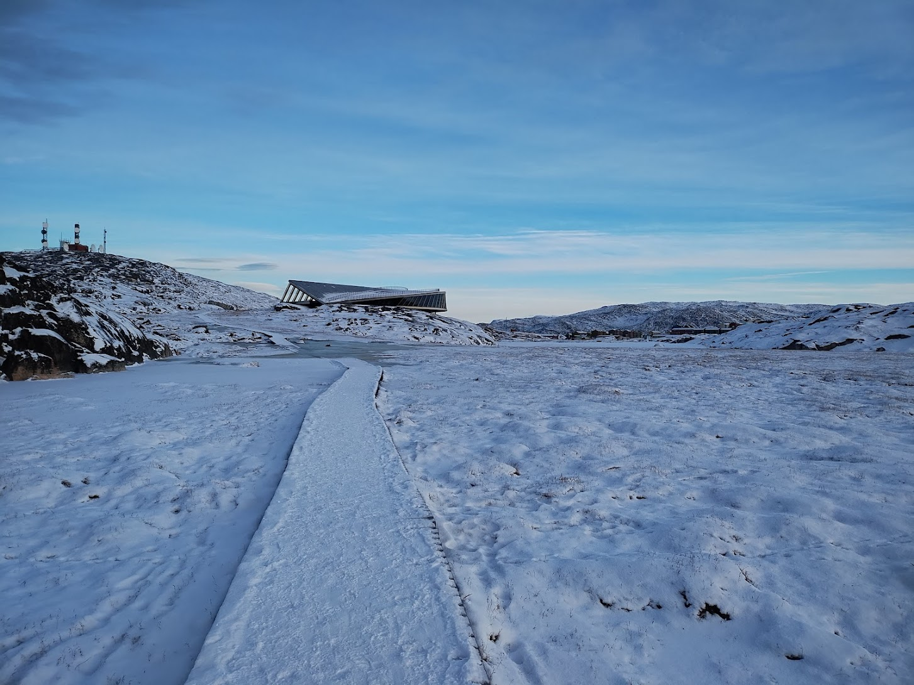

I'm happy to report that I slept well last night and woke fairly refreshed and
ready for the day! 

Today was very windy, which made for a good day to be inside. Thankfully, I was
already planning to visit some museums.

After eating breakfast at the hotel, I set off for the Ilulissat Cultural
History Museum. I spent about an hour and a half walking around the small
museum, which was once the childhood home of [Knud
Rasmussen](https://en.wikipedia.org/wiki/Knud_Rasmussen).

Among the topics covered at the museum were the history of the peoples of
Greenland, which stretches back to around 2500 B.C., the legacy of colonialism,
and present-day geopolitical tensions. 

There was also a great little exhibition about kayaks that included a list of
Greenlandic words related to kayaks and their equivilent in Danish and English:

{width=100%}

{width=100%}

Similarly, Greenlandic has many words for ice and snow, which allows them to be
expressive about describing the environment around them. There are many
different types of snow and ice, and Greenlanders know this intimately!

After the history museum, I went directy to the [Icefiord
Centre](https://isfjordscentret.gl/en/ilulissat-icefjord-centre/), which was
opened in July of 2021 and is housed in a beautiful building that is meant to
resemble a snow owl in flight.

{width=100%}

The centre has interactive exhibits about the icefiord, snow, how glaciers are
formed and how they generate icebergs, ice core science, and how Greenlanders
and the animals of this region interact with the environment around Ilulissat. I
ended up spending 3 hours here and could probably have stayed longer, but I had
other plans!

Following the visit to the centre, I grabbed a sandwich from a grocery store for
lunch and then headed to the ILLU Science and Art Hub, where the Ilulissat
Science Forum is being held over the next few days.

{width=100%}

I attended a session about local perspectives on change in the environment that
included a panel discussion that featured Jørgen (my dog sled guide from
Wednesday), someone who provides guided ski trips, and a climatologist from the
Danish Meterological Institute. It was an interesting and informative session! I
was given a pair of headphones that provided live translations from
Greenlandic to English. I felt like I was in a United Nations session!

Finally, to wrap up the day, I hiked back to the spot that I went looking for
the northern lights on Tuesday evening and tried my luck again. I spent about 2
hours stargazing and managed to see several shooting stars and the northern
lights, although they were rather faint. I had heard they got pretty intense
last night, so I was disappointed that I missed out on a more spectacular show.

Shortly after I got back to my hotel, however, I looked out the window and sure
enough - there they were! The most intense northern lights show I have seen yet,
right outside my hotel room! They were truly spectacular, and could be seen
across a large swath of the sky. Even now, as I am writing this, I can see them
outside my window! It is after midnight now, and I'm growing rather tired, so I
think I'll be falling alseep to the dancing lights.

{width=100%}
