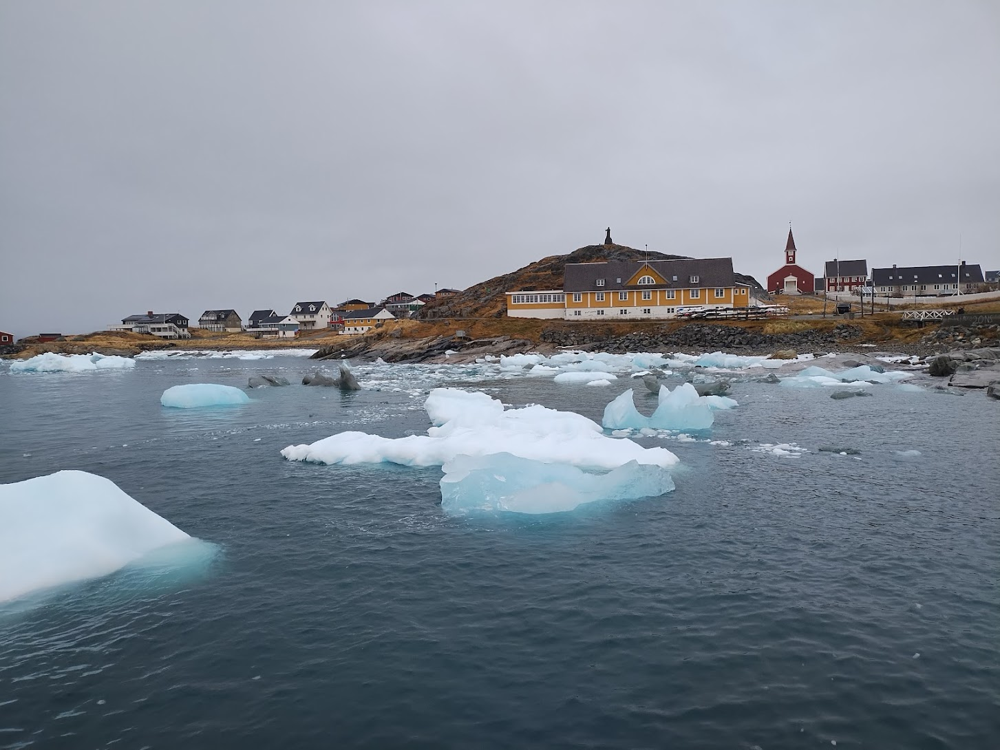

Today started off with a meeting with our collaborators at the
[Asiaq](https://www.asiaq.gl/en/) Greenland Survey, where we chatted about
QGreenland-Net related topics and future possibilities. This was a productive
meeting and we left feeling like we had some pathways for additional work. It
was great to have a focused conversation about our project with stakeholders in
Greenland!

Following our meeting at Asiaq, I did some laundry and then headed to the Nuuk
culture center for
[Qaagitsi](https://arctichub.gl/activities/qaagitsi-greenland-science-week-2025/),
the public-facing science festival day that capped off Greenland Science
Week. There were some talks going on and many small booths where individual
projects were showcasing their science. Most of the booths had fun little
exhibits and interactive components for kids (and adults!). I spent most of my
time wandering around and chatting with folks about their projects. It was
wonderful to see the public engaged and interested in the science being
conducted in Greenland!

{width=100%}

After spending some time at Qaagitsi, I spent some time walking around Nuuk, and
once again enjoyed some views of small icebergs off the coast. The weather today
was misty and relatively warm (low 40s F), but at least it wasn't as windy as
the last couple of days (many flights were cancelled due to high winds).

{width=100%}

Finally, to wrap up today, my team went out for dinner at a tapas restaruant. I
had some veggie croquettes, scallops, and a muskox slider alongise a locally
brewed beer.

{width=100%}

Today felt a little more relaxed than the last few, but I still feel pretty
tired after a long day of walking around and chatting with people. Tomorrow will
be my last full day in Nuuk (my return flight is scheduled for Sunday morning),
so I am going to get to bed and ensure I am well rested for it!
